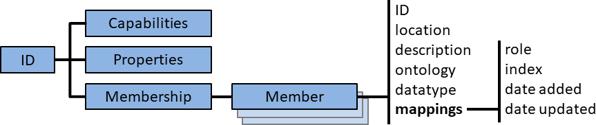
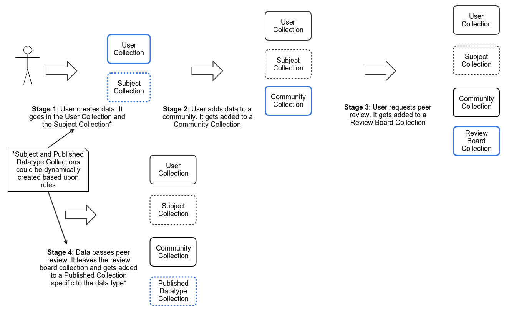

# Research Data Collections Working Group


## 1. Introduction

The management of digital objects remains an area of interest that crosses disciplines, institutions and infrastructures. The Research Data Alliance (RDA) has been driven by such challenges from its beginning, resulting in multiple interrelated recommendations. In particular, the PID Information Types (PIT) WG has defined a core model and the central interface for accessing object state information and provided a small number of example types, which were consequently registered in the Data Type Registry (DTR) WG prototype.  

While the PIT recommendation concentrates on individual objects, many workflows in data management are concerned with collections of objects. Collections are often described through metadata, and both within and across communities, suitable collection metadata schemas exist. Within RDA, it was however recognized that there is yet no single unified specification that enables the whole spectrum of create, read, update and delete (CRUD) actions that provide the necessary foundation for collection management tasks. Of particular interest were mechanisms that also incorporate PID management as a central aspect of collection concepts, since for some uses a persistent reference to dynamic collections is essential, and even if collections remain stable, their referenced objects may change, which drives the motivation to use PIDs as intermediary anchor points for collection members.

The goal of the Research Data Collections WG culminating in this recommendation was therefore to provide a unified model and interface specification for CRUD operations and collections, with particular observance of persistent identification and typing aspects. The recommendation allows building collections within diverse domains and then sharing or expanding them across disciplines. This should enable common tools for end-users and e-infrastructure providers. Individual disciplinary communities can directly benefit if such tools are made widely available, and cross-community data sharing can benefit from increased unification between collection models and implementations.
PID providers may benefit from marketing additional services on collections.

A common API for data management of collections will facilitate data interoperability and reuse by, (1) making solutions for managing collections more sustainable and widely available, thus (2) encouraging better data management practices and (3) allowing data objects in collections to be shared and re-used across projects and domains. It is not the intent of the working group to propose an alternative to existing well established standards for describing and archiving collections but rather to propose an API and implementation for creation, consumption, distribution and citation of collections and their items that could serve as a unifying layer _on top of_ the existing models and which can enable producers and consumers of collections to operate on data items managed in diverse collection models and repositories. Existing solutions focus on describing collections and their semantics with metadata, but do not offer a full set of generic, machine-actionable CRUD operations on them, which is a key innovation of the proposed API.

### 1.1 What is a collection?
Starting from scratch, you might just imagine that you have a number of objects that belong together. The type of these objects is not of particular concern, as long as they are in some digital form; this can include digital documents or scientific articles, individual data files, a zip of several files, digital images, audio or video recordings. Secondly, the specific reason why these objects belong together can also be motivated by a variety of concerns. There may for example be a number of files that came out of a scientific model calculation, or a number of recordings from a study session or a very distinctively selected choice of files grouped together for a particular analysis.

In conclusion, a collection is a very flexible mechanism to bind objects together without demanding particular semantics or formats. What is important, however, is that there is sufficient motivation to bundle the objects together for a time period and purpose that justify the additional costs of the required collection building action. The collection will also receive a distinct identity that persists over changes to its membership or properties, and as part of becoming such a distinct entity, it will offer a set of precisely defined actions that can be used to modify it.

### 1.2 What can we do with a collection?
A similar concept familiar from computer programming are common abstract data types such as lists, arrays and sets.
We know how to add, insert, replace or delete objects from such constructs, and we know that there are mechanisms for this in most higher programming languages.
But programming languages deal with objects in computational processes, while the motivation here is to manage research data objects that are not bound in computer code, but can, for example, be transferred, replicated or recombined, all of which may have a collection action dimension.

But despite the differences between abstract data types and research data management, the fundamental actions are similar: Put objects in the collection, take them out again, learn about the number of objects and their total size, look at all objects in the collection in an orderly manner and so on. We may also have some constraints on the collection, such as whether its objects are ordered or unordered, or whether there are further hierarchies inside it, which are also known concepts from collections at the programming level.

## 2. Requirements

While there are manifold usage scenarios for collections, several fundamental requirements exist to which the API specification with its CRUD operations also adheres to. The following list of requirements therefore applies to collections across implementations and disciplines. These requirements were assembled from a survey done prior to establishment of the WG and ongoing discussions throughout its lifetime.

 1. Collections must bear globally registered persistent identifiers (PIDs).
 2. Objects in a collection must bear unique identifiers. These can be PIDs, but also identifiers unique within a specific system’s context as long as they remain valid references throughout changes in object location within the system.
 3. Minimal state information on objects must remain retrievable using the identifier beyond the object’s lifetime.
 4. No assumption should be made on the lifetime of collections. Collections may be deleted at any time or kept over long time spans, depending on use case.
 5. Collections may contain sub-collections, but not recursively. It should be possible to restrict this rule for individual collections.
 6. Objects may belong to more than one collection.
 7. A single collection may contain objects stored at different places.
 8. Collections are finite.
 9. Any object that bears multiple identifiers may also be referred to by multiple identifiers within a single collection.
 10. Collections must offer well-defined actions (such as create, read, update, delete) that can be executed by software agents with minimal additional context required.
 11. A software agent should be enabled to determine usage or behavioural restrictions (“capabilities”) of a collection by querying a specific collection action. There should be no need for a caller to know the underlying model in advance, except in the case of collection creation.
 12. It should be possible to record the role of an object within a specific collection, independent from the role it has in the context of other collections.

There also some additional requirements that were discussed but did not reach consensus to become mandatory:

 1. Objects in collections should have registered data types. The specification supports a field to store data types, but does not make them mandatory or require a specific format. It is recommended, however, to align with the RDA recommendation on Data Type Registries.
 2. Collections should offer a listener/subscription model for collection change events. This was discussed and deemed quite valuable for advanced use cases, but introduces a level of complexity that was considered out of scope for the general specification. 
 3. Some elements in a collection may not be named explicitly, but rather given implicitly through a generation rule. Such *rule-based collections* were discussed and considered interesting as they offer a significantly different approach to collection management, more akin to dynamic database views. A rule-based collection could, for example, contain all objects that are of a specific data type, and thus extend by definition also to future objects of such type. However, the actual implementation of such a collection service is more complex than for descriptive collections, and it remained unclear how the rules and resulting mechanisms would be specified in an API and conceptually described in a solid way.

### 2.1 Implementation and Extensibility

In addition to the functional requirements, we need to consider that implementation and extensibility requirements will vary across deployments.  The API for operating against a collection should be standard, but it must be possible for the way in which that API is implemented, and the scope of the operations supported, to be variable.  

This variability is on levels: the functionality offered by the service, and the functionality implicit in a collection itself. In both cases, the variations must be explicitly expressed and machine-discoverable.

#### 2.1.1 Service Features

Implementations of the Collection Service may vary in the features they offer.  We have identified the following features which should be possible, but not required, of implementations:

1. the ability to assign PIDs to new collections
2. the ability to enforce access restrictions on collections
3, the ability to support paginated requests
4. the ability to support asynchronous actions
5. the ability to automatically generate new collections from existing collections based upon pre-defined rules
6. the ability to expand recursive collections (and limits of that expansion)
7. the ability to provide support for collection versioning
8. the ability to restrict or expand the supported set-based collection operations
8. the ability to restrict or expand the supported collection model types

#### 2.1.2 Collection Capabilities

Collection capabilities are the properties of any given collection which may impact the actions that are possible for that collection. This metadata is essential to working with a collection and therefore must be easily accessible by an implementation.
 
It should not be required, for example, for every implementation to build upon the PID Types API and the Data Types Registry. But in case these are supported, an example for such "allowed actions" would be that the collection only supports items who are of a specific data type X, as expressed by a type ID, or which, in addition, conform to a specific PIT profile (which requires a concrete minimal set of metadata to be included with the item).

We have identified the following collection capabilities which may impact how a producer or consumer operates on and with the collection and its contents:

1. whether or not member items have an implicit ordering
2. if ordered, where new items are inserted in that order
3. whether member items can assume specific roles with respect to the collection (e.g. such as becoming a 'default' item)
4. whether collection membership is static or mutable
5. whether collection metadata is static or mutable
6. whether member items are restricted to a specific data type
7. whether a maximum number of a members items is imposed

## 3. Definition
A first coarse-grained collection definition is as follows<sup title="Adapted from http://smw-rda.esc.rzg.mpg.de/index.php/Collection">[1](http://smw-rda.esc.rzg.mpg.de/index.php/Collection)</sup>:
> A collection is a digital object which bears a unique identifier and consists of a finite number of digital object identifiers and metadata associated with each referenced identifier.

Informally, we refer to the elements referenced in a collection through identifiers as the collection’s content.
The elements are digital objects, and collections are digital objects themselves.
Elements that are other collections are called subcollections of the given collection.
A collection and its subcollections define a graph.
A collection is finite, if the set of identifiers generated by iteratively resolving its subcollections is finite, i.e., if the graph has a finite number of nodes.
Infinite collections may therefore exist in theory, but are too hard to manage in practice and therefore considered to be out of scope here.

A collection’s elements may be arranged in a particular form, including unordered (set) and ordered (list) form.
Ordered form may be useful to describe inherent semantics of a collection, for instance, to arrange subsequent versions of a digital object in order or capture a strict order of slices of a time series.

### 3.1 Fine grained collection definition

We define the following elements within the scope of what we consider collections, with a direct connection to how the Collection API is structured:

A **collection** is a 4-tuple of an identifier, capabilities, collection properties, and membership. 

**Collection Capabilities** fully comprise the set of actions that are supported by it. Actions may affect collection properties or membership. *Remark*: (1) An external agent may provide more actions than are in a collection's capabilities, e.g. more sophisticated composite actions or actions across multiple collections.  (2) An agent submits a capability request to a collection to retrieve the action set.

**Collection properties** comprise essential metadata regarding the collection, who have a primarily informative purpose, whereas collection capabilities determine the possible actions on a collection.
 * *Examples:* General collection state information such as its creation date, ownership and license, description, possible relations to other collections, like parent collections, or a pointer to a more sophisticated description ontology.

The **collection membership** is a finite multiset of collection members. Collection membership may either be defined explicitly or implicitly through a generation rule. 

A **collection member entry** consists of a member identifier and multiple member properties, which are further subdivided into general properties (the member's location, description, data type and ontology) as well as multiple **mapping properties**, which are member metadata only valid in the context of the particular collection such as member role, index, and timestamps for when the member was added or updated within the collection. Note that a collection can become a member of another collection by adding it to it, referencing the subcollection's identifier. If the collection member is not a collection itself, we call it a **collection leaf**.

The following figure illustrates the overall structure of these various elements.



As membership is a multiset, multiple membership of identical items is possible, which can be of practical relevance in ordered collections, for instance. The notion of *mapping* properties originates in the idea that there is an inherent mapping function that points from membership to mapping metadata elements. This function is injective, as multiple items can be related to the same metadata.

In addition to the definitions listed above that comprise the structure that is also reflected in the API, we can also take a conceptual viewpoint focused on what comprises the collection's dynamic state and internal mapping relations. This results in an alternative approach to structuring, which may help to understand the concept and is captured in the following two brief definitions:

We first define the **collection state** as the 3-tuple of collection membership, collection capabilities and collection metadata.

The **collection metadata** comprises the collection properties, all member mapping metadata and the mapping function.

## 4. Use Cases

### 4.1 DKRZ use case: Climate data management

Scientific groups and research institutions around the globe develop individual climate models, which are run on their respective HPC systems. However, there is no perfect climate model, and all of them model the physical world in different ways. To assess the quality of climate models, a large exercise is therefore needed: Running the various models with same input and boundary conditions, producing data that can then be analyzed and compared to assess the differences between models or to generate aggregated “ensemble” data products (basic statistics). This exercise is called the Coupled Model Intercomparison Project (CMIP<sup>https://www.wcrp-climate.org/wgcm-cmip</sup>). 

CMIP is in essence a cyclic activity, with each phase running for several years. The previous phase, now finished, was CMIP5; the current phase is called CMIP6. The insights resulting from CMIP data are eventually also used to back the Assessment Reports of the Intergovernmental Panel on Climate Change (IPCC), and therefore, the community workflow of CMIP is also intertwined to some extent with IPCC processes.

#### 4.1.1 ESGF data collection perspectives

Throughout its phases, CMIP data have grown rapidly in volume, exceeding the capabilities of a single institution to handle data collection and distribution. The global Earth System Grid Federation (ESGF<sup>https://esgf.llnl.gov</sup>) has been set up to as a data infrastructure to support CMIP data management, and DKRZ contributes to its development in multiple areas. 

CMIP6 data are at the most basic level netCDF data files, with each individual file containing a single data variable of a single simulation over the simulation's time range and covering the whole globe. Each file also bears an individual PID. These files are then combined into datasets, which consequently represent all data (all variables) from a single simulation.

The already existing solution for aggregating files into datasets (and assigning a PID to these aggregates) can be extended to become conformant with the Collections API to enable standardized read access from third parties. Moreover, this could also stretch to cover an existing pilot implementation that enables end-users to bundle individual collections of datasets and get a referenceable PID for these bundles. 

#### 4.1.2 Climate data processing collection use case

An implementation scenario that is a continuation along a typical user workflow is the use of collections to aggregate data processing outputs. Some users will need to further process CMIP output, for example, to produce specific data subsets or to extract meaningful indices across multiple datasets. The required processing tools exist, for example COWS based on PyWPS<sup>http://cows.badc.rl.ac.uk/</sup>, the Birdhouse processing framework<sup>http://bird-house.github.io/</sup> developed at DKRZ, the Ophidia framework<sup>http://ophidia.cmcc.it/</sup> or the climate4impact.eu<sup>http://www.climate4impact.eu</sup> portal. It is planned that these tools are extended and improved to become common server-side services as part of future projects. 

Processing service output may be quite varied, but in case it does not consist of atomic output, the use of persistently identified collections will enable users to easily refer to the output of a processing call and possibly submit it as a whole to collection-aware data sharing services. Moreover, if processing input data are already bundled with collections, e.g. if it is part of CMIP6, the basic provenance relationship between the collections may be recorded through dedicated metadata.

### 4.2 Perseids Project

The Perseids Project <sup>(http://perseids.org)</sup> provides a platform for creating, publishing, and sharing research data, in the form of textual transcriptions, annotations and analyses.  The platform itself uses a collection-centric data model, where each dataset produced on the platform is treated as a vertical collection of heterogeneous data objects. In addition, each item in a dataset can be thought of as belonging to one or more other global collections of data objects, grouped by data type, primary topic, community, or other criteria. 

For example, User A, a member of Community B, creates a dataset that include a data object which is treebank (<sup>https://en.wikipedia.org/wiki/Treebank</sup>) of a set of passages from a canonically identified text, Homer's Iliad Book 1, lines 1-10.  Community B has editorial process which enables annotations from members of the community to pass through a peer review process before publication. This data object might belong to:

* the collection of all Ancient Greek treebank data
* the collection of all annotations about Homer's Iliad
* the collection of all annotations about Book 1 Lines 1 through 10 of Homer's Iliad
* the collection of all data created by User A
* the collection of all data approved by the Community B editorial board

As an open platform, we want all data we produce to be easily shared and reused by the larger community, at all stages of the publication lifecycle.  Our requirements call for each data object, as well as the collections themselves, to be able to be persistently identified, versioned, carry fine-grained provenance metadata and be validated against a profile, schema or other verifiable criteria. To facilitiate reuse, we must be able to:

* describe collection items as machine-actionable data types, independent of their identifier schemes, and the properties of the collection to which they belong.
* create reusable templates of collection types with standard descriptive properties and capabilities
* express relationships between collections, items within a collection, and items across collections using one or more standard ontologies
* perform simple CRUD/L operations on collections and items in a collection
* perform more complex discovery operations on collections based upon the properties of individual collection items, such finding all items across all collections that match or don't match or contain a specific item. 

### 4.3 GEOFON use case: seismological data centre

The German Research Centre for Geosciences (GFZ) provides valuable seismological services in the form of a
seismological infrastructure named GEOFON to research and better understand our complex system Earth.

GEOFON is not only one of the fastest earthquake information provider worldwide, but also one of the largest nodes of the European Integrated Data Archive (EIDA) for seismological data under the ORFEUS umbrella, which is a distributed data centre
established to (a) securely archive seismic waveform data and related metadata, gathered by European research infrastructures, and (b) provide transparent access to the archives by the geosciences research communities.

GEOFON has archived seismic waveforms since 1993 and currently archives around 10.000 streams daily from seismic stations
sending data in real-time from all around the world.

The standard way in which seismological data centres provide data to users is based on specifications provided by
the International Federation of Digital Seismograph Networks (FDSN<sup>http://www.fdsn.org/</sup>). An API is available, which let users define the contents of the dataset and create them _on-the-fly_, but the specification does not contemplate the idea of pre-assembled datasets.

Data requests could be classified in two big groups: the ones related to an earthquake and the ones related to an experiment.
In general, most of the data requests are related to the time and location of an earthquake. After any big earthquake thousands of data requests are received with a considerable overlap of data between them (similar short time window and variable set of stations), but quite rarely exactly the same dataset.

But there are also some users who request _all data produced in an experiment_, or _all data recorded by a station_. This results in a big amount of data requested (with long time windows and a fixed set of stations) to be later processed and not particularly related to any earthquake.

Only at GEOFON, we have more than 6 million successful requests/year, which are created dinamically (not predefined).
It would be impossible for us, mainly due to storage limitations, to replicate the requested datasets by keeping a copy of each dataset. Therefore, there is no way for a user to reference the dataset for future use (publication, share with someone else). Today, the user can only share the _request definition_, but if there are new data in the requested time window or new streams in the set of stations defined the resulting dataset will be different from the original one. Quite rarely it could also happen that some data were deleted.

From the data centre perspective it is also difficult to offer big pre-assembled datasets to be downloaded, due to the
resources needed for their storage.

In this context, we find very appealing the idea of using a Data Collections System in order to define and save both
types of data requests. In the case of the big pre-assembled datasests we can define collections containing only
"pointers" (e.g. PIDs, URLs) to the files which are included. This would imply almost no extra storage, as only the
pointers are saved. Therefore, we could also expose our archive through the definition of big datasets with a
marginal increase in the space needed.

In the case of the dynamic datasets we could follow the same approach. Namely, for each request we could define a collection with the PIDs of the files which fall into the range of values defined by the user.
If new data comes in the future _it will not appear in the collection_, because the content of the dataset will
not be recreated based on the original query, but on the files which originally formed the dataset.

In both cases, once a collection is created it is possible for the user to reference it for later use (e.g. share it
with others or use it as supplementary information for publications).


## 5. Additional collection operations

As explained until now, the conceptual model for collections and the Collection API specification are flexible enough to support a variety of usage scenarios. The specification expresses this flexibility through collection capabilities, properties and methods, which can be used quite freely. While the API specification aims to provide the most common operations on collections, some of the possible operations are only valid for specific *collection models*. A collection model is understood as a specific configuration of a collection through its capabilities or properties that restricts usage beyond these. An alternative interpretation that was also discussed within the group was that of traits related to trait-based programming, where the main point would be that such traits are not defined orthogonally to each other and that the combination of traits is a key aspect.

By introducing these extended limits, additional operations become possible. These operations are listed in the descriptions below. The API specification defines capabilities and properties that together describe such models. However, the API specification does not describe the resulting additional operations as they were seen as exceeding the basic API scope, and should therefore be understood as suggestions to implementors for further extensions. 

The following are some examples for collection models:
1. Ordered collection: If a collection is ordered, a *getSlice* operation can be introduced, with start and end index parameters. For a collection with modifiable membership, a *replace* method with indexes may be useful.
2. Limited size collection: If a collection has a maxLength set in its properties, a *calculateTotalSize* operation becomes feasible. Note that such an operation could always be offered, even if maxLength is not set, but might be expensive. 
3. Hierarchical collection: If a collection is finite and has member collection items, operations such as *calculateMaximumDepth* and *calculateNumberOfDirectChildren* are possible.

This list is notedly not considered exhaustive; depending on specific usage scenario or special cases, e.g. within specific disciplines or running infrastructure and services, further models may be useful with even more detailed special operations. The main reason for not including them in the API specification was that the additional value they provide was judged to be too much limited to specific user groups so that including them as base functionality would make the generic API too heavy. This, of course, does not preclude going down such a route in future revisions once usage scenarios widely demand particular model behavior. 

One further operation of potentially high interest is in case of hierarchical collections a *getParent/getParents* operation. The feasibility of such an operation depends on whether hierarchical parent collections are actually recorded within the properties of child collections, which requires the actor who adds a collection as member to another collection to be able and allowed to modify the parent collection's properties. There are multiple potential issues with such an approach, including security and scalability, which is why it was not considered eligible for the general API specification.

## 6. Data Types and Data Type Registration of Collection Elements

All collection elements and its components need to be defined in a transparent way. Because a mayor goal is an automated way of processing collections, these definitions have to be transparent also for machines, which implies machine actionable registries for such definitions. RDA has suggested so called data type registries (DTRs) for this kind of purpose and a definition of a collection element therefore would here become a data type referenced by a persistent identifier and described in a DTR. A typical data type in such a registry has beside its PID a name, a description, applicable standards, some provenance information and can express named dependencies from other types. A more concise decription of the data type registration of collection elements can be found in the Appendix.

## 7. Permission Management

We expect implementations of the Collections API to have differing requirements and solutions for enforcing access on collections and their member items. The API specification does not presume anything about the mechanism through which access control is enforced, but allows the implementation to declare whether whether or not it enforces access via a Service feature property.  

The OpenAPI specification <sup>(https://swagger.io/specification)</sup> we have used to document the API provides the means through which an implementation can specify a SecurityScheme <sup>(https://swagger.io/specification/#securitySchemeObject></sup> for individual API operations. This supports standard OAuth2 workflows, as well as basic authentication and API keys.  The Collection API also specifies use of the standard HTTP 401 response code for unauthorized requests on any operations which might be subject to access controls.

In addition to service and operation level access controls, the API enables the declaration of whether an individual collection itself has access restrictions, and the license and ownership of the collection, via Collection level properties. 

For information on how to implement authentication and authorization solutions, we recommend turning to Single Sign On standards such as OAuth2 <sup>(https://oauth.net/2/)</sup>, Shibboleth <sup>(https://shibboleth.net/)</sup> and SAML <sup>(https://en.wikipedia.org/wiki/SAML_2.0)</sup>. 


## 8. API

[http://rdacollectionswg.github.io/apidocs/#/](http://rdacollectionswg.github.io/apidocs/#/)

The API should enable advanced functionality (e.g. search), to be built by consumers of it, but not all such functionality is in scope for the API itself.

## 9. Implementation

## 10. Adoption Efforts

### 10.1 RPID Test Bed

The Perseids Manifold implementation <sup>(https://github.com/RDACollectionsWG/perseids-manifold)</sup> of the Collections API is included in the RPID Test Bed <sup>(https://rpidproject.github.io/rpid)</sup>. The RPID testbed is intended to stimulate and enable evaluation of the complementary outputs of RDA in PID oriented data management. The testbed includes a Handle Service, a Data Type Registry, a PIT API, along with the Collections API, and is available for research, education, non-profit, or pre-competitive use through 2019.

### Perseids Project

The Perseids Project currently uses the Perseids Manifold implementation of the Collections API to manage its collections of annotations.  When an annotation data object is created on Perseids, it gets added to: (1) the collection of all annotations created by the that user; (2) a collection representing the specific publication to which the annotation data object belongs; and (3) if the annotation identifies a canoncial text source via a CTS URN <sup>(http://cite-architecture.github.io/ctsurn/overview/)</sup> as its primary topic of interest, the data object gets added to one or more collections of annotations about that topic depending upon the granularity of the CTS URN identifier. 

Future enhancements would be to extend the use of the Collections API through the entire lifecycle of the publication, as set forth below:




### GEOFON Project

GEOFON has worked on an implementation of this specification since its early stages in order to manage the definition and storage of pre-assembled datasets, to register the user requests, and to offer the capability of downloading these datasets.

We have even extended the specification with methods to download members of the collection and also the collection as a whole. The latter can be done either by concatenating the members of the collection, what is very useful in the case of the file format used for seismic waveforms, or by downloading a zip file with all its members.

The only methods which have not been implemented are the operations on the collections (/collections/{id}/ops/) and the ones to add and remove the properties of members.

This implementation is being used internally at GEOFON (in beta stage) with more than 6000 collections and 1.5 million members. 

### Fedora

The working group chairs initiated discussions with the Fedora Repository (http://fedorarepository.org/) development team to explore the feasibility of adding support for the Collections API to Fedora.  We believe that in order to achieve our goals of enabling widespread data sharing, RDA outputs like the Collections API must be implemented by the infrastructures researchers are already using for managing their data and collections.  Repositories like Fedora are an obvious candidate for this. The the work the API-X community (https://wiki.duraspace.org/display/FF/Design+-+API+Extension+Architecture) has done to implement an API Framework for adding services to Fedora should provide the hooks needed to fairly easily implement the RDA Collections API as an added-value service. Further, the Perseids Manifold implementation has already confirmed that it is possible to use the API to manage collections of data which are expressed according to the Linked Data Protocol model used by Fedora. We have issued a call to both the RDA Collections Working Group and the Fedora Community development community to identify stakeholders for this effort <sup>(https://groups.google.com/forum/#!topic/fedora-community/FFFGrjq54x0)</sup>.

## 11. Conclusion and Outlook

The general concept of collections and the facilities the common API provides can also be a point for interfacing and integration with Linked Data and ontology usage in general. In line with considerations by the RDA Data Fabric IG, the foundation for research data management is seen at the level of digital objects, with enabling technologies such as persistent identifiers and type registries. Collections provide a layer on top of these, and they express some essential relations between individual objects. The Collection API also offers some anchor points to extent this notion of inter-object relations further. These relations should be integrated into a further Linked Data layer, and certainly enriched with more relations that go beyond the collection scope to provide an encompassing, seamless metadata view. An underpinning of formally encoded ontologies can then provide the semantic dimension needed for agents to make autonomous decisions based on both Collection API actions and Linked Data.  

## 12. Appendix

### 12.1 Data Type Registration of Collection Elements

#### 12.1.1 Hierarchical Data Types, Semantics and Disambiguation

The description of dependencies alone, as it was foreseen in the Outcome of the Data Type Registry Working Group of RDA, does not allow a distinction of the way, how dependent types are related to the parent type and to each other for these typical data types as they are described for DTRs in the RDA outcome of the DTR working group. In order to exactly describe types dependent from other types, like those necessary for collections, one needs to implement more structure into the DTR. Data types with this kind of additional information are called hierarchical data types. A special implementation of such hierarchical data types in the ePIC DTR, that refers to JSON schema for the specification of data structure, is described in more detail in [1]. As one additional feature for hierarchical data types one obviously needs some kind of end points without any further reference. These are called basic types in the context of the ePIC DTR (http://dtr.pidconsortium.eu). 

As a side remark: if one equips these basic types with syntactic requirements (schemas), the specification of the dependency structure allows to provide schemas also for the dependent types.

An important feature of the description of dependent types is that one can assign special names to them in the context of the parent data type (named dependencies). Here a data type with a given name and description can became a completely different semantic in the context of the parent dependent of this type, e.g. a unicode string can become a description or a license agreement or author name.

In the context of hierarchical data types this naming becomes even more important, because the names refer inside the DTR to the PIDs of their data types, and because, with some structure, they are hierarchically relying eventually on basic types, these names are, by the dependencies inside a data type, completely defined structures. This has the advantage that for a data type, given by its PID, one can use these possibly ambiguous internal names as references, because they are disambigued by their type PID and their internal dependency structure.

As a consequence for a given hierachical data type the use of human understandable names for substructures still leads to a well defined total structure and this total structure is completely transparent for machine actions by the type PIDs given in the data type as corresponding to these human understandable names. In other words for hierachical data types it is sufficient to refer to the overall data type PID in order to maintain human readable structures. 

Which data type is choosen as the referred overall data type, is in general a context dependent granularity decision, as one can see for example in the collection use case as described below.

#### 12.1.2 Collection Member Type Description

There exists a data type definition called Collection2 that references the five elements identifier, description, properties, capabilities and membership at the ePIC DTR. In order to get a complete type definition for this Collection type, a type definition for each of its five dependencies, their dependencies and dependencies of dependencies ending with basic types as boolean, integer or string is provided. A complete list of the currently defined types in the collection context is given in the subsection about currently registered types below. The current definition of membership in the DTR is compatible, but in fact a bit more complicated, to ensure also the collection registry implementation in a Handle Server, as described in the following subsection.

In the context of collections the decision about the overall data type reference can give different different granularities. Which data type granularity is used, is essentially a question of what metadata about a collection is stored in which way in a collection registry. One possibility would be to reference to a type named Collection (s.a.) as a data type consisting of the types given for the five names above. Another is to use the five elements identifier, description, properties, capabilities and membership individually as data type references.  Even another could distinguish between the collection content, the membership, from the collection metadata, the identifier, description, properties and capabilities, and uses these two as data type references.

As an additional data type one always needs the ServiceFeature, which gives information about the collection registry in its whole.

Other granularities as above are also possible, but they lead in general to less transparency for humans, because the PID references need to be more and more explicit. On the other hand human readability can be achieved by using the machine readable information in the DTR to automatically transform outputs into the named structure by content negotiation. But this requires additional implementation overhead.

#### 12.1.3 A Generic Collection Registry Implementation based on Type Values stored in the Collection PID

Because the Handle System as PID provider allows the storage of additional data type values to a given Handle PID, it is an obvious possibility to implement a collection registry on top of a Handle Service by creating for each new collection a PID and store all of the above described collection elements as types inside this PID.

Such an approach has a couple of advantages. One needs to get a PID for a collection anyway and the Handle record allows the storage of type values and this is provided by an API, therefore all one needs is at one place. If one prepends the pathes as provided by RDA for the collection API with the prefix of a Handle Service, one gets a generic collection registry implementation, that can be used across different communities and user groups. The only requirement for a user group would be, to have access to a Handle Service. Such a generic implementation also ensures, that the collection data is always based on the data types as already defined in a DTR. And if one has also schemas available at the data type, as with automated schema generation of the ePIC DTR, one is able to control the data provided for creation and modification of the collection and refuse the operation with a qualified error message.  

The necessity to distinguish between the collection registry authorization and Handle Server authorization vanishes. This can be both an advantage or a disadvantage and depends on the  authorization policies in question.

A disadvantage is the possible overload of the Handle Server. The collection metadata fields are rather restricted in size, and also they should not change too often, because they refer to the whole collection and not to changements in its members. But especially if the membership is huge or changes too often, this traffic can obstruct the Handle Server. 

For the membership therefore one could think of a solution by a reference to a digital object in an external repository, which containes then the membership data. This can be determined even at the individual collection level: whether the membership data of a collection is internal or external can be easily distinguished: if it is an array of member items, it would be internal, if it is an identifier string, it would be external. A membership with only one member item is also a list consisting of this only member item. The creation and changement of external membership data needs additional access to that repository of course.
There exists already an implementation as a very early prototype based on flask for such a generic  collection registry allowing internal or external membership data. 

#### 12.1.4 References
[1] Schwardmann, U.: Automated schema extraction for PID information types, IEEE International Conference on Big Data,  5-8 Dec. 2016, IEEE, DOI: http://hdl.handle.net/10.1109/BigData.2016.7840957.

#### 12.1.5 Overview on Currently Registered Types

```
"Collection" : {                      # dictionary
  "id"                                : "21.T11148/2037de437c80264ccbce"
  "content":
  {
   "id"                               : "21.T11148/0dd75e3528dd246977ec",
   "membership"                       : "21.T11148/ec9db37ca4b137579592",
   "capabilities"                     : "21.T11148/362d2035d5045b3885b6",
   "properties"                       : "21.T11148/e200c0c8256011f46a25"                                                                                              
  }                                      
}                                                                                                                            
"ServiceFeatures" : {                 # dictionary
  "id"                                : "21.T11148/dfa8a42e6041fdf25a9d"
  "content":
  {
   "providesCollectionPids"           : "21.T11148/0aa131a13395660a337d",                                                                                              
   "collectionPidProviderType"        : "21.T11148/9537e4ffe90f49761a83",                                                                                              
   "enforcesAccess"                   : "21.T11148/fcfcf6aac968a2ed84d0",                                                                                              
   "supportsPagination"               : "21.T11148/106b017cc09783d26c4a",                                                                                              
   "asynchronousActions"              : "21.T11148/0d1d7d4fd99d13f1399d",                                                                                              
   "ruleBasedGeneration"              : "21.T11148/36f5a2e42cc1f07e1c97",                                                                                              
   "maxExpansionDepth"                : "21.T11148/f477816b2f5dd4c21fd0",                                                                                              
   "providesVersioning"               : "21.T11148/b0857cf2c32290238f4a",                                                                                              
   "supportedCollectionOperations"    : "21.T11148/ffcddb18da563e38f2ba",                                                                                              
   "supportedModelTypes"              : "21.T11148/ff3e31a0f6593eca24f2"                                                                                               
  }                                                                                                                                                                   
}
"capabilities" : {                    # dictionary
  "id"                                : "21.T11148/362d2035d5045b3885b6"
  "content":
  {
   "isOrdered"                        : "21.T11148/f73e9e53f28f7a2daa96",                                                                                              
   "appendsToEnd"                     : "21.T11148/7c73a5ef3ad537f3540a",                                                                                              
   "maxLength"                        : "21.T11148/80fbf92a544e0b78c3a5",                                                                                              
   "membershipIsMutable"              : "21.T11148/68f0dc4c89fe708aa946",                                                                                              
   "metadataIsMutable"                : "21.T11148/8012c128c2bca2e99c29",                                                                                              
   "restrictedToType"                 : "21.T11148/f786eb287a05ec0f31a7",                                                                                              
   "supportsRoles"                    : "21.T11148/1cb7c5016257cbada745",                                                                                              
  }                                                                                                                                                                   
}
"properties" : {                      # dictionary
  "id"                                : "21.T11148/e200c0c8256011f46a25"
  "content":
  {
   "modelType"                        : "21.T11148/2d1e64bc217fce96a569",                                                                                              
   "descriptionOntology"              : "21.T11148/88356ff4f8d62a1b9fd0",                                                                                              
   "memberOf"                         : "21.T11148/553ccd655e23ef942e44",                                                                                              
   "license"                          : "21.T11148/dc54ae4b6807f5887fda",                                                                                              
   "ownership"                        : "21.T11148/6ac2e9b06358dc21e812",                                                                                              
   "hasAccessRestrictions"            : "21.T11148/683d2a6545516a65c985"                                                                                               
   "description"                      : "21.T11148/d6532ef6dc2b2a4ea01e",
  }                                                                                                                                                                   
}                                   

"membership" :{                       # dictionary
  "ID"                                : "21.T11148/ec9db37ca4b137579592",
  "content":
  {
   "MemberItemList"                   : "21.T11148/e139307f7a797b6e0f72"
  }
} 
                                                                                                                                  
"MemberItemList" : {                  # array
  "ID"                                : "21.T11148/e139307f7a797b6e0f72"
  "content":
  {
   "MemberItem"                       : "21.T11148/195f306b750096f4fb6c"
  }
} 
"MemberItem" : {                      # dictionary
  "id"                                : "21.T11148/195f306b750096f4fb6c"
  "content":
  {
   "id"                               : "21.T11148/0dd75e3528dd246977ec",                                                                                             
   "location"                         : "21.T11148/1bba2359c61cfee6948c",                                                                                             
   "description"                      : "21.T11148/d6532ef6dc2b2a4ea01e",                                                                                             
   "datatype"                         : "21.T11148/6a3cacc825e61d9e383f",                                                                                             
   "ontology"                         : "21.T11148/20b84403f089c73e4016",
   "context"                          : "21.T11148/ec2727b3b71f07635f72",
   "mappings"                         : "21.T11148/feed63a23d1d6d7e0e08"
  }
}  
"mappings" : {                        # dictionary
  "id"                                : "21.T11148/feed63a23d1d6d7e0e08"
  "content":
  {
   "role"                             : "21.T11148/31cf58fed6ddd1b96102",
   "index"                            : "21.T11148/85f498d4e97df8d70dab",
   "dateAdded"                        : "21.T11148/0ffdf247d605a5b40853",
   "dateUpdated"                      : "21.T11148/e563e40ec891f2fea158"
  }
} 
```

